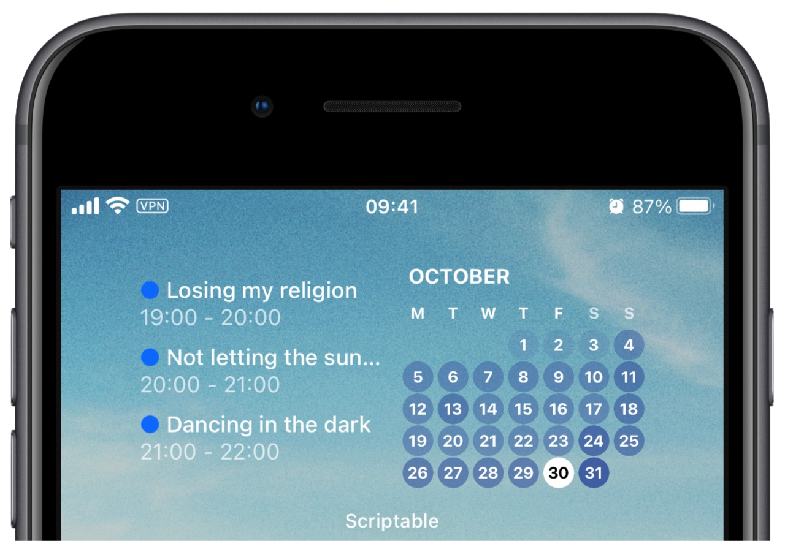
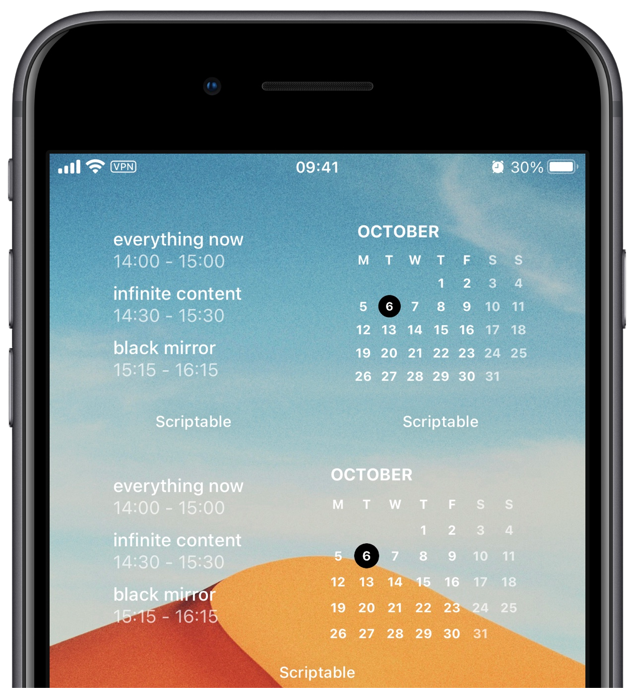

# Scriptable Calendar Widget

    

- [Scriptable Calendar Widget](#scriptable-calendar-widget)
  - [Setting Up](#setting-up)
  - [Settings](#settings)
  - [Small widgets](#small-widgets)
  - [Development](#development)

## Setting Up

- Copy the script in [calendar.js](./calendar.js) to a new script in Scriptable app.
- Run the script first which should prompt Scriptable to ask for calendar access.
  - If it didn't and you haven't given Scriptable calendar access before, try changing the `debug` setting to `true` and trying again.
  - **To have the widget open the iOS calendar app, switch `debug` back to `false` afterwards.**
- Add a medium sized Scriptable widget to your homescreen.
- Long press the widget and choose "Edit Widget".
- Set the `Script` to be the script you just created and `When Interacting` to `Run Script` which will then launch Calendar app when you tap on the widget.
- Return to your home screen which should now hopefully show the Scriptable calendar widget.

## Settings

- `debug` - set to `true` to show the widget in Scriptable, `false` to open a
  calendar app.
- `calendarApp` - Tapping on the widget launches a calendar app (as long as `debug: false`), by default it launches the iOS Calendar app, however it can be changed to anything as long as the app supports callback URLs. Changing the `calshow` to something else would open other apps. E.g. for Google Calendar it is `googlecalendar`, for Fantastical it is `x-fantastical3`.
- `backgroundImage` - Image path to use as the widget background, which is taken either from the widget parameters, from the `params` variable at the top, or just replace `params.bg` with the image path. To get an image that can then be used to have a "transparent" widget background use [this](https://gist.github.com/mzeryck/3a97ccd1e059b3afa3c6666d27a496c9#gistcomment-3468585) script and save it to the _Scriptable_ folder on iCloud. Then set either the widget parameter (long press on the widget -> edit widget -> parameter) to `{ "bg": "my-image.jpg"}` where `my-image` is the name of your transparent background **OR** change the line which has `{ bg: "1121.jpg" }` to include your image name.
- `widgetBackgroundColor` - In case of no background image, what color to use.
- `todayTextColor` - color of today's date
- `markToday` - show a circle around today or not
- `todayCircleColor` - if we mark days, then in what color
- `showEventCircles` - adds colored background for all days that have an event. The color intensity is based roughly on how many events take place that day.
- `eventCircleColor` - if showing event circles, then in what color
- `weekdayTextColor` - color of weekdays
- `weekendLetters` - color of the letters in the top row
- `weekendLettersOpacity` - a value between 0 and 1 to dim the color of the letters
- `weekendDates` - color of the weekend days
- `locale` - a Unicode locale identifier string, this would change the weekday letters to the specified language.
- `textColor` - color of all the other text
- `eventDateTimeOpacity` - opacity value for event times
- `showEventsView` - to show the events view or not, this would be set through widget parameters in order to set it per widget basis. (check: [Small widgets](#small-widgets))
- `showCalendarView` - to show the calendar view or not, also set through widget parameters.
- `showAllDayEvents` - would either show or hide all day events.
- `showCalendarBullet` - would show a `●` in front of the event name which matches the calendar color from which the event originates.
- `startWeekOnSunday` - would start the week either on a Sunday or a Monday.
- `showEventsOnlyForToday` - would either limit the events to today or a specified number of future days with `nextNumOfDays`
- `nextNumOfDays` - if `showEventsOnlyForToday` is set to `false`, this allows specifying how far into the future to look for events. There is probably a limit by iOS on how far into the future it can look.
- `showCompleteTitle` - would truncate long event titles so that they can fit onto a single line to fit more events into the view.
- `showPrevMonth` - would show days from the previous month if they fit into the calendar view.
- `showNextMonth` - would show days from the next month if they fit into the calendar view.

## Small widgets

    

The script also supports small widgets or a medium widget with just one part. In this case the widget parameter (long press on the widget -> edit widget -> parameter) should be set to something like:

- `{ "bg": "top-left.jpg", "view": "events" }`
- `{ "bg": "top-right.jpg", "view": "cal" }`

Where `"events"` specifies the events view and `"cal"` the calendar view. (Setting the background is not necessary).

## Development

- `npm install` - install dev dependencies
- `npm run dev` - this watches for file changes, bundles them, fixes syntax and copies the output file to iCloud. This workflow is not tested on any other system but mine which is a macOS, so it is very likely to break on anything else.
