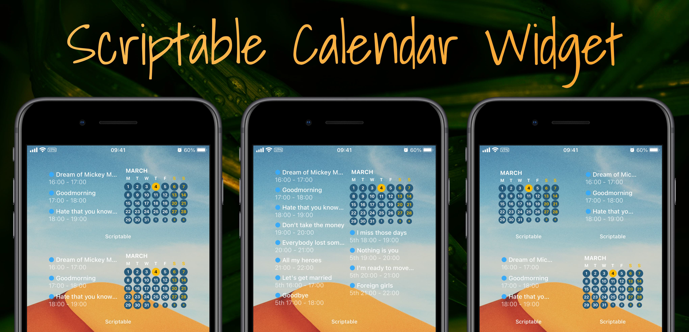

<p align="center" >
    
</p>

- [Setting Up](#setting-up)
- [Customization](#customization)
- [Small Widgets](#small-widgets)
- [Large Widgets](#large-widgets)
- [Development](#development)

## Setting Up

- Copy the script in [calendar.js](./calendar.js) to a new script in Scriptable app.
- Run the script first which should prompt Scriptable to ask for calendar access.
  - If it didn't and you haven't given Scriptable calendar access before, try changing the `debug` setting to `true` and trying again.
  - **To have the widget open the iOS calendar app, switch `debug` back to `false` afterwards.**
- Add a medium sized Scriptable widget to your homescreen.
- Long press the widget and choose "Edit Widget".
- Set the `Script` to be the script you just created and `When Interacting` to `Run Script` which will then launch Calendar app when you tap on the widget.
- Return to your home screen which should now hopefully show the Scriptable calendar widget.

## Customization

It is recommended to put your settings into another script named `calendar-settings.js` or in script parameter, so that updating the calendar script will not reset your settings.

The basic syntax of `calendar-settings.js` could be:
```js
module.exports = {
  // Put the settings you want to customize here
  calFilter: ['Work'],
  locale: 'ja-JP',
  startWeekOnSunday: true,
  showEventLocation: true,
  theme: {
    // See below section
  }
}
```
You can write anything in the settings script as long as the script is exporting an object.

### Available Settings

- `debug` - set to `true` to show the widget in Scriptable, `false` to open a
  calendar app.
- `calendarApp` - Tapping on the widget launches a calendar app (as long as `debug: false`), by default it launches the iOS Calendar app, however it can be changed to anything as long as the app supports callback URLs. Changing the `calshow` to something else would open other apps. E.g. for Google Calendar it is `googlecalendar`, for Fantastical it is `x-fantastical3`.
- `calFilter` - Optionally an array of calendars to show, shows all calendars if empty. Can be supplied as a widget parameter to only affect that particular widget.
- `markToday` - show a circle around today or not
- `showEventCircles` - adds colored background for all days that have an event. The color intensity is based roughly on how many events take place that day.
- `eventCircleStyle` - `circle` or `dot` style for indicating event. `circle` will have a circle background. `dot` will show a dot below the day.
- `discountAllDayEvents` - if true, all-day events don't count towards eventCircle intensity value
- `smallerPrevNextMonth` - date size for previous or next month
- `locale` - a Unicode locale identifier string. Default follow device setting.
- `widgetType` - for small widgets it determines which side to show. This would be set through widget parameters in order to set it per widget basis, rather than setting here and having all small widgets be the same type. (check: [Small widgets](#small-widgets))
- `themeName` - `light`, `dark` or `auto`. `auto` will follow device setting
- `theme` - theme object containing custom theme settings. See [Theme Settings](#theme-settings) for available settings
- `showAllDayEvents` - would either show or hide all day events.
- `showIconForAllDayEvents` - show an icon for all day event.
- `showCalendarBullet` - would show a `●` in front of the event name which matches the calendar color from which the event originates.
- `startWeekOnSunday` - would start the week either on a Sunday or a Monday.
- `showEventsOnlyForToday` - would either limit the events to today or a specified number of future days with `nextNumOfDays`
- `nextNumOfDays` - if `showEventsOnlyForToday` is set to `false`, this allows specifying how far into the future to look for events. There is probably a limit by iOS on how far into the future it can look.
- `showCompleteTitle` - would truncate long event titles so that they can fit onto a single line to fit more events into the view.
- `showEventLocation` - show the location infomation of the event if availabe.
- `showEventTime` - show or hide the event time.
- `clock24Hour` - use 12 or 24 hour clock for displaying time.
- `showPrevMonth` - would show days from the previous month if they fit into the calendar view.
- `showNextMonth` - would show days from the next month if they fit into the calendar view.
- `individualDateTargets` - would allow tapping on a date to open that specific day in the calendar set by the `calendarApp` setting. (atm, supports default iOS calendar and Fantastical callback urls, should be possible to add more).
- `flipped` - the layout for the medium-sized widget can be either the default, `events - calendar`, or a flipped, `calendar - events` layout. This setting can also be given as a widget parameter (something like: `{ "flipped": true }`) to just affect that particular widget.

### Theme Settings
You can customize the color settings of the widget. To get started, choose one of the `light` or `dark` theme and override the theme base on it: (See [Customization](#customization) if you don't know how to change settings)
```js
module.exports = {
  // ...your other settings
  calFilter: ['Work'],
  locale: 'ja-JP',
  ...
  // Customize the theme
  theme: {
    backgroundImage: 'my-image.jpg',
    todayTextColor: '#ff6600',
    textColorPrevNextMonth: '#0000ff',
    // You can choose change some settings only, or change everything
  }
}
```

- `backgroundImage` - Image path to use as the widget background. To get an image that can then be used to have a "transparent" widget background use [this](https://gist.github.com/mzeryck/3a97ccd1e059b3afa3c6666d27a496c9#gistcomment-3468585) script and save it to the _Scriptable_ folder on iCloud.
- `widgetBackgroundColor` - In case of no background image, what color to use.
- `todayTextColor` - color of today's date
- `todayCircleColor` - if we mark days, then in what color
- `eventCircleColor` - if showing event circles, then in what color
- `weekdayTextColor` - color of weekdays
- `weekendLetterColor` - color of the letters in the top row
- `weekendLettersOpacity` - a value between 0 and 1 to dim the color of the letters
- `weekendDateColor` - color of the weekend days
- `textColorPrevNextMonth` - text color for previous or next month
- `textColor` - color of all the other text
- `eventDateTimeOpacity` - opacity value for event times

## Small Widgets

The script also supports small widgets in which case the widget parameter (long press on the widget -> edit widget -> parameter) should be set to something like:

- `{ "bg": "top-left.jpg", "view": "events" }`
- `{ "bg": "top-right.jpg", "view": "cal" }`

Where `"events"` specifies the events view and `"cal"` the calendar view. (Setting the background is not necessary).

## Large Widgets

The script should detect on its own that it is running in a large widget and will adjust accordingly.

## Development

- `npm install` - install dev dependencies
- `npm run dev` - this watches for file changes, bundles them, fixes syntax and copies the output file to iCloud. This workflow is not tested on any other system but mine which is a macOS, so it is very likely to break on anything else.
